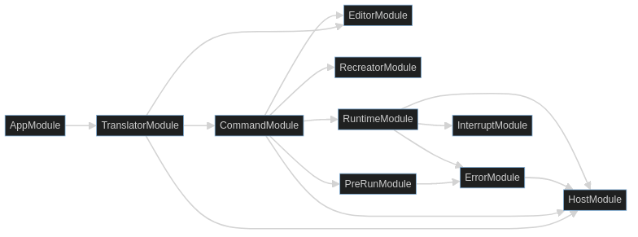

# Matanuska BASIC

Matanuska will be a BASIC intended to run as a shell. It asks what it would've
been like if the classic 80s BASIC was better able to rise to the occasion
when it came to disk features and/or competing with DOS.

## Installation

```bash
npm install
```

## Running the app

```bash
npm start
```

## Test

```bash
npm test
```

## Prior Attempts

This is roughly my fourth attempt. Here are some notes on prior attempts:

- s7bas - a YOLO attempt at writing a basic from scratch, based
  largely on the MSX Technical Handbook. I learned at TON but ultimately
  realized I needed to step back and figure out how you would actually
  architect a modern BASIC interpreter.
- 2 attempts to port yabasic to rust. I successfully ported most of the scanner
  from yabasic, changed focus to doing Crafting Interpreters, sketched out a
  few patterns, then realized I should be prototyping in typescript
- this project, which has a basic scanner and some architectural structure,
  written in typescript

The few rust snippets I want to port over to typescript can be found in the
[./rs](./rs) directory - namely, parsing for strings and numbers.

## Resources

My two major resources are [Crafting Interpreters by Robert Nystrom](https://craftinginterpreters.com/contents.html)
and `Writing Interactive Compilers and Interpreters` by PJ Brown. The former shows
how to write a lox interpreter in both java (tree-walking) and C (bytecode).
The latter is from 1979 and is BASIC-oriented, but less example-driven.
The outputs from my work with `Crafting Interpreters` can be viewed at
<https://github.com/jfhbrook/crafting-interpreters>.

## Languages

### Source Language

This is the BASIC code itself. I intend to implement a pretty classic BASIC
to start, and then add features over time. The most important of those are
shell-related - supporting spawning [jobs](https://www.baeldung.com/linux/jobs-job-control-bash),
stream redirection, pipelines etc. Another big one will be a built-in test
framework, if only so I can easily test Matanuska *in* Matanuska.

#### Sigils

BASIC has *manifest* data types, meaning you can tell what type they are based
on syntax. Strings use a `$` postfix sigil, integers have no sigil, channels
use a prefix `#`, and dim syntax always involves parens. This makes it so your
IR can use codes which assume the data type, while being easy to recreate into
formatted source code.

In my case, data types will be a bit more complex, and I'll probably need/want
to adopt sigils more broadly, [a la perl](https://www.perl.com/article/on-sigils/).

Here are some sigils perl uses:

- `$` for scalars. we probably can't or shouldn't do that.
- `@` for arrays.
- `%` for hashes. It collides with the mod operator, but traditional BASIC uses
  `mod(a, b)` anyway, and that works for me
- `&` for subroutines. That seems like an unlikely use for me.

Other characters which could potentially be other sigils: `~`, `!`, `?`

#### Arrays

In traditional BASIC, arrays are pre-allocated. I think in my language, if
you substitute an integer identifier for a 1-d array it should be unallocated?
So `dim(i)`?

Question: dim access doesn't seem to have an obvious return type - you can
store anything as the value in a dim, right? Or are dims in BASIC integer only?
Do I want to use sigils for dims? ie., `dim$(i)`?

#### Hashes

A big open question is how I'm going to support hash-like data structures.
There are two big alternatives:

1. Augment arrays to support associative array features, similar to Lua tables
2. Implement a separate `Record` type, inspired by Pascal

If I do associative arrays, consider the syntax `dim($)`, where I use the
string sigil to represent "this dimension is string-valued". I could also
support `dim($, i)` or `dim(i, $)` potentially?

Anyway: I'm tickled by the tables idea, but it makes the typing a lot more
squishy than a standard BASIC.

#### Modules

Variable access in BASIC tends to operate on a namespace, and the operand
stack is mostly used for evaluating expressions. In fact, subroutines often
have a namespace under their name.

Modules are also a natural extension of Programs - ie, instead of your program
being a Program, it's the "main module".

If I combine all of this with a JavaScript-style "with" and perhaps a
prototype abstraction for modules, it opens up interesting possibilities in
terms of doing object-oriented stuff.

#### String Templating

I won't implement these right out of the gate, but this functionality is
basically required for a shell.

### Encoding Language

This is the language used to *implement* the interpreter. I'm *starting* with
typescript and node.js. This is because typescript is one of my strongest
languages - writing an interpreter is hard enough and I don't want the added
overhead of fighting a language I'm bad at. Plus, I *like* typescript, *and*
I think it will make a really nice extension language.

That said, if I want to make my interpreter *performant*, I'll want to
implement it in a compiled language. I've historically been leaning towards
Rust, and in fact have prototyped a lot of stuff in Rust. Rust comes with
a number of advantages:

1. Decent [toolkits](https://neon-bindings.com/docs/introduction) for implementing
   node bindings
2. A lot more high level abstractions and data structures than something like
   C
3. Good building and testing facilities
4. A nice ecosystem to work with
5. Memory safety when viable
6. "unsafe" abstractions when necessary

However, using C++ to implement a Node addon may be a better fit:

1. Is the [official extension mechanism](https://github.com/nodejs/node-addon-api)
2. With [cmake.js](https://github.com/cmake-js/cmake-js), supports a build system I don't hate
3. Unsafe abstractions are "normal" and don't require the same amount of rigmarole as Rust does
4. C-like language means plagiarizing Crafting Interpreters is easier, less "translation" effort

Using C++ will mean some potential testing issues - do I call test functions
from typescript? Use callbacks to the test harness in C++? Etc. It also means
not having some of the nicer abstractions in Rust.

Note, however, that I can mix and match - I can expose Rust abstactions over
a C-style API if I want to link into the C++ addon, and if I glue together
multiple addons in Node.JS then I can choose language per addon.

All that said, this is all stuff I plan on punting on until I have a
practically usable language.

### Abstract Syntax Tree

I will be implementing an AST. This tree will be a collection of
lines, each of which has an optional line number and a root node representing
the contents of the line. This is the format which will be stored in the
Editor.

One important property of the AST is that it can be recreated back into valid
source code. This saves us from the responsibility of storing raw source code
(as well as the corresponding space). But it also gives us opinionated
formatting for free.

Another important property of the AST is that its parser captures all syntax
errors which can be discovered without the context of other lines. This lets
us give syntax errors to users early, before they try to run a complete
program.

To start, I will also be interpreting against this AST. This will be easier
than implementing a full bytecode VM and get me a head start on something
that *works*. This will allow me to iron out features and behavior, build out
testing infrastructure, and build out resolving (and other pre-run concerns)
in relative isolation.

#### Line Numbers

The base collection for lines will likely be an Array. This is really
convenient for linear scanning, but less convenient if you want to seek to a
particular line. Lines will need to support many operations - editing,
compiling (or pre-run and execution), recreating and resequencing
(re-numbering) being a few.

The choices are basically between keeping line number inside the AST and
scanning forward to get to any element you need, and indexing line numbers in
a hash.

### Bytecode

Later, I will compile from the AST into a bytecode at runtime. The compiler
that does this work will effectively replace the "pre-run" abstraction used
to execute the AST directly. Unlike the bytecode in Writing Interactive
Compilers and Interpreters, it will *not* be recreateable - instead, I will
retain the use of the AST for those purposes. While this does mean two ways
of representing the code, it retains the two-stage aspects of the architecture
- translation and pre-run - and allows for a simpler bytecode with much higher
levels of optimization.

#### Bytecode Assembler

While working on the bytecode, I'll also need an assembler format. Being able
to parse the format would be extremely cool, likely not that difficult, and
would stand as a useful tool to test the vm more closely than BASIC can. But
the more important part is generating it so I can visualize bytecode being
generated by my interpreter.

## Architecture

These notes describe the intended architecture. 

An architecture diagram for the first milestone can be seen here:



### Host

WIC&I refers to this as the I/O module. I'm borrowing a page from posh and
calling it the Host.

This is the one component which varies based on environment or frontend - that
is, `Host` is an interface, and while I use a `ConsoleHost` in my implementation
I could easily plug in a `BrowserHost` in the future.

Host has a lot of responsibilities, *because* it's the primary interface to
the system:

- prompting/reading input
- writing simple output and/or logging - this it shares with a posh host
- file reading/writing and tracking file handles
- process spawning, stdio redirection and tracking child processes/PIDs
- ports - both serial and networking, as well as HTTP
- drawing procedures - ie, wrapping [ink](https://github.com/vadimdemedes/ink),
  [ratatui](https://github.com/ratatui-org/ratatui), etc.

### Translator

This component contains the main REPL loop and feeds parsed lines to other
components. The basic loop is:

1. Read source code input from the prompt
2. Use the scanner and parser to generate the AST for a line
3. If prefixed by a line number, feed to the Editor
4. If *not* prefixed by a line number, feed to the command module as an
   immediate command

The Translator may also non-interactively read directly from a file.

### Editor

The editor is what's in charge of taking lines from the Translator and updating
a `Program` accordingly. Its interface is similar to a dictionary.

The Command module will be in charge of initializing the Program, so either
Command will delegate to Editor or Editor will delegate to Command.

### Recreator

In many BASICs (and in mine), you *don't* save the original source when
converting to an IR. This means that I'd need to be able to convert the IR
*back* to vaild source code. WIC&I calls this recreating. Unlike traditional
BASIC, however, we will be recreating from a tree, not a bytecode.

A nice bonus is that my recreator is effectively also the standard formatter,
when combined with parsing.

### Program

In WIC&I, a `Program` is the core abstraction for storing IR, environment
information and certain kinds of metadata useful for recreating source from
IR.

CI doesn't have this abstraction as such. Instead, jlox has a parsed AST,
Environments, and so forth; and clox has chunks, closures, the stack and
so forth, all stored on its `vm` object (analogous to WIC&I's "runtime").

This document refers to a `Program` in a WIC&I sense, partially because it
was written when I thought I was going to follow it more closely but also
because I'm not entirely sure what the actual set of abstractions will look
like in practice. I intend to use an AST similar to jlox, but with a stack
like in clox.

### Scanning and Parsing

I'm starting out with using parser combinators, namely typescript-parsec.
This should let me write a lexer and parser which map pretty closely to
a recursive descent style parser, as seen in both WIC&I and CI. However, I
might implement expressions using a Pratt parser (a great example in CI) and
I may hand-roll a scanner in the future.

One combinator I need to think about is a `synchronize` combinator, which can
eat invalid tokens to the end of the malformed command in an effort to recover.
The point of recovering here is to flag the rest of the obvious syntax errors
in the input without having an avalanche of cascading issues.

I'm doing this in typescript for now, but I may port to rust and nom in the
future. Though, note, rust/nom will require either implementing a `Token` type
or foregoing tokens in favor of lower level str-based combinators.

### Pre-Run Module

Lines are initially parsed without knowing the context of the rest of the
program. A lot can be checked ahead of time - you can even allocate space for
variables ahead of time! But a lot of things will need to be checked or
"filled in" after editing is done but before actually running the `Program`.

In other words, this component is a second pass in a two-stage compiler, which
has the context of the entire program.

In v1, I'm going to be executing the AST directly. That means doing a linear
scan on the AST and filling in fields which are set to `null` on translation.
Broad strokes:

1. Ensure variables are defined before they're used
2. Ensure for loops, if statements, and so on, are properly nested/closed
3. Resolve addresses for GOTOs and the like - things that would be `null` in
   the IR while editing

#### Compiler

In a v2, I would like to replace the pre-run module with a compiler that
generates bytecode. It will do many of the same things as the pre-run module,
but will generate bytecode instead of tagging nullable fields in the AST.


### Runtime

The runtime maps loosely to `vm.c` in the C lox implementation from CI. It owns
the program counter, the call stack, the symbol stack, and everything else
needed to actually run compiled bytecode.

### Command Module

The command module is effectively session management.

#### initializing and resetting sessions

- initting/resetting the Program
- initting the Host
- loading history
- running autoexec.bas
- printing any startup messages

#### decoding non-runtime commands

Imagine that, in my language, editing commands and things like `run` aren't
able to be executed by the runtime as part of a Program. In this case, the
command module would be squarely in charge of accepting that command,
interpreting it, and delegating it accordingly.

This isn't totally wild. In fact, the node.js repl has a number of non-js
commands. These are prefixed by periods - an example is `.exit`. If I want,
I can follow this convention as well.

Immediate statements, however, complicate things. Non-command immediate
statements *must* be executed by the runtime. But it can still make sense for
the command runner to delegate the immediate statement, especially if it can
handle non-runtime commands. Note, however, that if *all* commands are
runtime statements, this method becomes very small indeed.

#### break-ins and other halts

If there's a break-in interrupt, the command module would be in charge of
pausing execution, making sure everything is in a good state, and handing
things back to the translator.

Note that, in the case of errors, the command module would be in charge of
*recovery*. The errors module can only be in charge of *reporting* errors,
and otherwise needs to trigger the command module's break-in functionality
with an interrupt.

#### cleaning up on exit

- gracefully shutting down running jobs (in bash parlance)
- getting the host to clear handles
- flushing history

### Errors

Errors are going to be a BIG part of the interpreter, especially since most
arbitrary input is going to be a syntax error of some kind.

For now, I'm intending on having a centralized component that's in charge of
taking error inputs, formatting them to text, passing that text to the Host,
and handing off recovery to the command module.

### Interrupts

Interrupts will be interesting, especially in an async context. The primary
use cases for interrupts so far are keyboard interrupts and/or breaking to
debugger, but basically any event will involve an interrupt of some kind.

### Garbage Collection

In theory, I won't need garbage collection because TypeScript already does
it. But if I end up needing it, I can implement mark and sweep like CI does.

### Testing

#### Source Language

My thinking here is to make `TEST` and `ASSERT` commands, which - when testing
mode is enabled in the `Runtime` - generate [tape](https://www.npmjs.com/package/tape)
tests. Then, if testing mode is enabled, actually run the tests.

I'll need a pretty reporter. I'm thinking about hooking tape up to
[node-tap's reporter module](https://github.com/tapjs/tapjs/tree/main/src/reporter).

#### Encoding Language

I'll of course need to write tests for *everything*. Because I'm probably
using `tape` to write the source language tests, I'll probably use it to write
the typescript tests too.

Something I want to do for tests is stack effects. Each operation should have
an expected and consistent stack effect. I plan on making a simple DSL that
clocks [factor](https://github.com/factor/factor/blob/master/extra/rot13/rot13.factor#L6)
and generating tests off that.

In general, tests should cover:

- combinations of various facilities
- nesting
- things in, on and out of bounds
- null values, expected or otherwise
- infinite and/or "ridiculously large" cases - may need to autogen test programs
- ridiculous syntax errors
- any and all error cases - there are a LOT more errors than correct code!

This means one way to test is to try running an obviously incorrect program
and assert the error output is as-expected. This will probably require a
vcr-like facility.

Some things - like break-ins or non-runtime command errors - will need to be
tested interactively. This may be helped with an expect-like module, but worst
case can be done with a runbook. Definitely have a runbook though.

Finally, it's a good idea to have runtime asserts. These can cause a
"FLAGRANT ERROR" to occur, which tells the user that it's MY fault, not THEIRS,
and offers to buy them a beer if they report it (and meet me in person).

#### Performance Tests

Both WIC&I and CI stress the importance of performance tests. 
PJ says to compare your performance to similar languages - for me, that
probably means `bash` and other shells. Bob says to compare performance before
and after a code change, to see if your optimizations are actually helping.

### Debugging

#### Break-In

I want ctrl-d to pause execution and enter a "debugger" state. This will mean
having to get interrupts right, but it should be a really neat feature.
Or, if WIC&I is to be trusted, crucial.

#### Symbol Dump

These are similar to "heap dumps" in node. However, I'd want these to be easily
read by a human being without using external tools. Generating the
[v8 format](https://github.com/jwalton/node-heapsnapshot-parser/blob/master/src/HeapSnapshot.coffee)
is not the worst idea, but I don't want that to be the only option.

#### Profiler

WIC&I shows this as a map from the line to how often it's been executed. This
is basically the same idea as modern profiling, but a little simpler due to
the nature of a classic BASIC.

I thought about implementing profiling with opentelemetry, and I haven't
ruled it out *completely*, but a big limitation of otel spans is that the
instrumentation emits a single event when a span closes, and the collector and
query engine has to construct the full picture after the fact. That makes it
tough to show traces until after execution is complete.

A really cool stretch goal would be to implement flame graphs. But for my own
sanity, starting simple will still be useful.

#### Disassembler Output

Somewhat analogous to clox's debug output, and/or printing the raw javascript
`Program` object. Stuff like this is useful for the compiler developer.

This can be optionally disabled in "release" versions and/or with a variable,
but it's not harmful to expose this as a "secret" command either.

#### Help

PJ actually says good errors are better than interactive help. That said, I
should still write documentation.

### Cmdlets

I *think* I can implement commands using classes similar to powershell cmdlets.
Basically a cmdlet would use parser combinators and/or an IR Builder to
implement commands. This could be a REALLY cool way to extend the base
language. But we'll see.

### Require/Import/Source

None of my resources give a treatment to imports. My guess is that each
"import" is basically a separate `Program` keyed by a namespace, and that my
call stack becomes namespace-aware. But this should be pretty late in the
game.

Note that I can't really use the `export` keyword, since that term's overloaded
by exporting env variables. Instead, I'll probably just export "everything"
like Python does by default.

## Next Steps

I've finished both WIC&I and Crafting Interpreters, and I have a pretty good
idea of the overall strategy I want to take.

Generally speaking, I want to implement a tree walk interpreter in TypeScript,
get the behavior and testing down, and then increase levels of sophistication
towards a bytecode VM. I also believe I want to start with a stack as in clox,
even though I'm working with an AST.

WIC&I suggests this overall order for implementing things to start:

- Get the Host module so it can do basic IO - prompting and output
- Get error reporting infrastructure in place, so I can immediately report
  errors when I cause them
- Ensure there's a "not implemented" error
- Get (interactive) print working
  - MVP of translator and runtime
  - A stub prerun
  - A very simple command module
  - Notably, not editing, as we're not actually editing a program yet
- MVP of symbol dump and profiler
- Editing - save/load programs - and non-interactive execution
- Tests that run example programs and assert their output

Eventually, when I have nesting and/or call stacks, I can implement the
in-program test harness and start using *that*.

## The Future

Once I actually have the bedrock of a working BASIC, there are three general
directions to go in.

First, I'll want to get the base language completed and tested, and have a good
idea of how it's the same or different from other classic BASICs, like
MSX BASIC or C64 BASIC. this may involve porting old BASIC games to s7bas, such
as "acey ducey".

Second, the *actual* goal for this project isn't just to write a BASIC, it's
to make a BASIC which can replace bash:

- shell pt 1: the basics
  - `spawn <REDIRECTS>;ARGS` instruction - args can be unquoted but variables must be in `()` or template string
  - `shell <REDIRECTS>;SCRIPT` instruction - minimal script parsing, pass directly to SHELL
    - BONUS: sessions
  - `export VARIABLE`/`unset VARLABLE` - export/unset variable to the env created by spawn/shell
  - `cd`, `dir`, etc - "disk BASIC" inspired directory/file navigation/operations
  - bash-inspired template strings
  - reading and writing files through "named file descriptors"
  - `source FILENAME`
  - `~/.autoexec.bas` support (a la `~/.bashrc`) using `source` functionality
  - did you know about bash's `jobs` command? that could influence how processes are modeled
- shell pt 2: starship
  - `PS1` analogue
  - before/after hooks prompt and spawning/shelling
  - NOTE: needs dates, datetimes + durations
  - script that can be pasted into`autoexec.bas`
  - examples: <https://github.com/starship/starship/tree/master/src/init>
- shell pt 3: shell expressions?
  - `spawn`, `shell`, `call` as expressions
  - bitwise operations, ie pipes
  - note that we can already redirect streams to named pipes through instruction syntax

third, I want MUCH better data structures. in very loose order of priority:

- hashes/dicts - be thoughtful about this!! maybe ruby or posh flavored? maybe an associative `dim`?
- vector/tensor-like arrays/dims
  - should be able to do n-dimensional w/ research and testing
  - should be able to cast 1-d and 2-d to vectors and matrices
  - implement `.\` and `.*`
  - add `'` (transpose)
- dates/datetimes/durations
  - needed for timings, which is a loose prereq for starship support
- objects/records
  - almost certainly prototypal, no such thing as a class
  - has js-like key iterability but treated as public/private properties
- tables + sqlite support
  - inspired by posh
  - possibly inspired by cobol?
  - *possibly* inspired by lua??
  - `select` expression?

## Other Resources

- [MSX2 Technical Handbook](https://konamiman.github.io/MSX2-Technical-Handbook/md/Chapter2.html) - the
  language spec, plus a bunch of detail on the internal memory structure of MSX BASIC
- [choosing a combinator](https://github.com/rust-bakery/nom/blob/main/doc/choosing_a_combinator.md) - the
  go-to resource for figuring out what combinator I need to do rusty things
- [yabasic](https://github.com/marcIhm/yabasic) - a BASIC with good language
  features and a clean codebase. My plan is to target close compatibility with
  yabasic's core language to start, and evolve from there.
- [monkey-rust](https://github.com/Rydgel/monkey-rust) - a good
  example/reference for how to do token-based lexing/parsing with nom
- [nom_locate](https://crates.io/crates/nom_locate) - this library will make
  it easier to track position/spans inside the lexer/parser, which will help
  make MUCH better errors.
- [error management](https://github.com/rust-bakery/nom/blob/main/doc/error_management.md) - nom's
  error handling is a little funky - &str lifetimes are finnicky - and I'll
  need to do some heavy lifting to get useful errors out of it.
- [miette](https://crates.io/crates/miette) - when I'm ready, this should
  help me print dank errors.

# Licenses

- monkey-rust: BSD 3-clause
- yabasic: MIT
