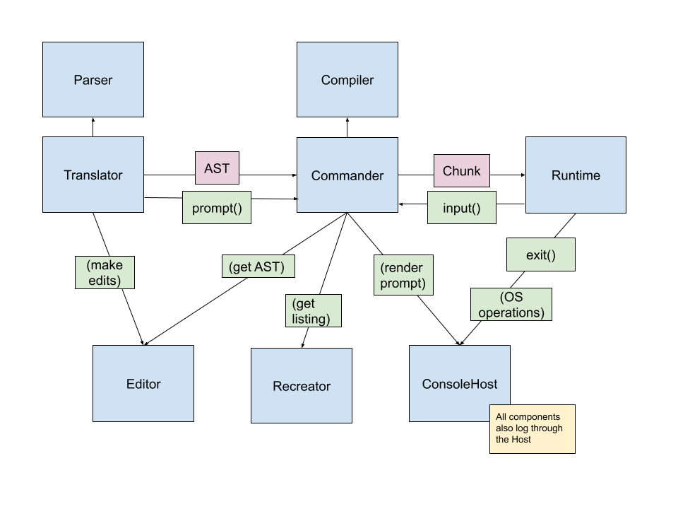
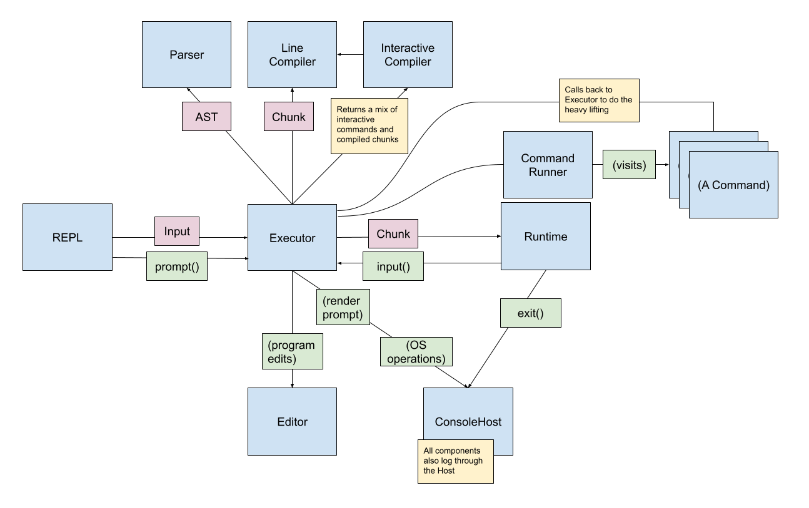

# ADR 010 - Architecture, Revisited
### Status: Draft
### Josh Holbrook

## Context

In [ADR 002](./002-architecture.md), we outlined an initial architecture
based on the book `Writing Interactive Compilers & Interpreters` by PJ Brown.
But as implementing Matanuska has progressed, the actual architecture has
deviated from that design. This document details these changes, along with
their rationale and consequences.

### Architecture v1 Diagram

For illustration, here is a diagram of the architecture prior to significant
refactors away from the design in ADR 002:

### On WIC&I

While I don't think it's entirely accurate to say nobody was doing object
oriented programming in the age of PJ Brown, I *do* think it was uncommon,
and the book doesn't indicate the use of any particular patterns. Chief
among these is the visitor pattern, as detailed in `Crafting Interpreters`
by Robert Nystrom. Matanuska uses the visitor pattern extensively.

I also believe that the concept of a "translator" may have overlap with the
concept of a REPL ("read-eval-print loop"). The concept of a REPL
[came from Lisp)(https://en.wikipedia.org/wiki/Read%E2%80%93eval%E2%80%93print_loop),
with origins in 1964 but popularized with Scheme in the 80s. I don't have
strong evidence of this, but I suspect the terminology (and implied
architecture) wasn't common outside Lisp until non-BASIC, non-shell scripting
languages gained popularity in the 1990s; and the Open Source Movement
(particularly as related to GNU) spread the gospel of Lisp.

  - Renamed commander to executor
  - Actual command(s) module executes visitor pattern on interactive commands
  - editing is now in the executor, not the translator
  - translator combined with index and Cli, is basically just the `repl`
    function
  - who should own readline? executor? host? translator?
  - WIC&I didn't have the benefit of OOP, mind you

## Decision

The architecture after significant refactors looks like this:

I will now dive into the differences between this architecture and the
previous architecture.

### The Executor and the Command Module

