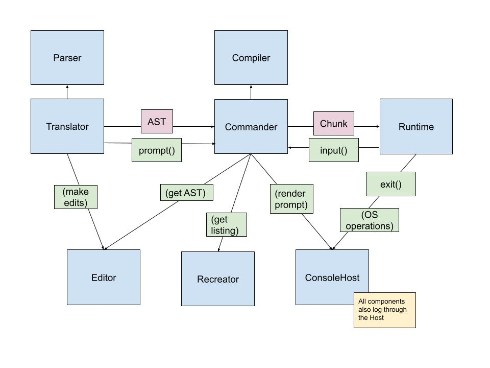
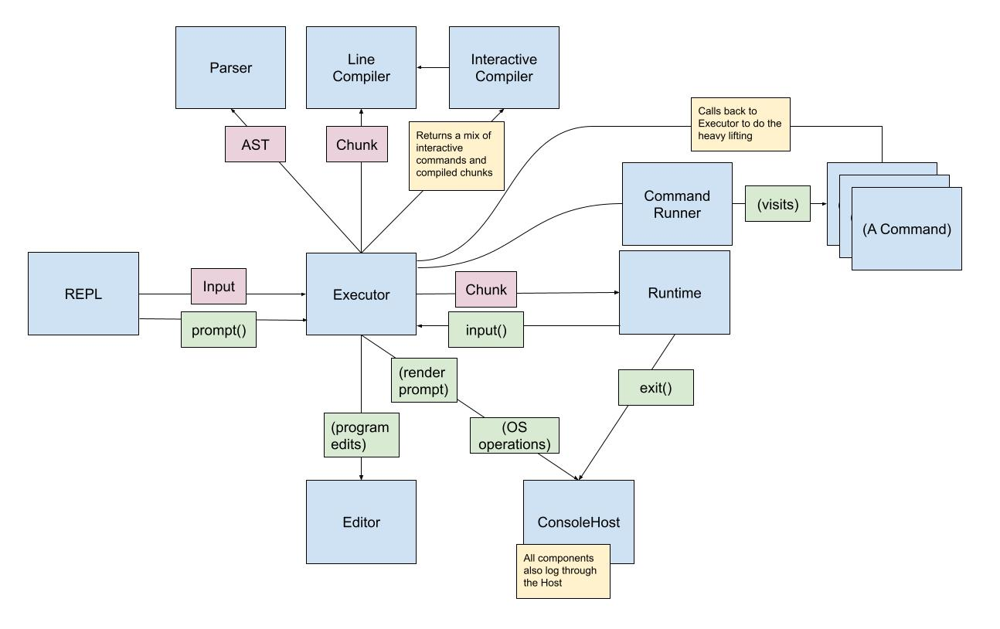

# ADR 010 - Architecture, Revisited

### Status: Accepted

### Josh Holbrook

## Context

In [ADR 002](./002-architecture.md), we outlined an initial architecture
based on the book `Writing Interactive Compilers & Interpreters` by PJ Brown.
But as implementing Matanuska has progressed, the actual architecture has
deviated from that design. This document details these changes, along with
their rationale and consequences.

### Architecture v1

Let's start with a diagram of the architecture prior to significant refactors
away from the design in ADR 002:

In this architecture, that Translator is responsible for reading input
from either an interactive session or a script, parsing it, adding lines to
the editor, and passing parsed ASTs to the Commander. The commander,
meanwhile, is in charge of both compiling and executing runtime commands,
_and_ directly executing non-runtime interactive commands (such as editing).
The editor is referenced by both the Translator and the Commander - the
former writes to it, and the latter reads from it. Finally, the initial
architecture called for a "recreator", which would take parsed ASTs and
convert them back to source code.

## Decision

The architecture after significant refactors looks like this:

I will now dive into the differences between this architecture and the
previous architecture.

### The Executor and the Command Module

First, the Commander has been renamed to Executor, though it retains much
of the responsibilities of the "command module" called for by WIC&I. Second,
a second command subsystem (literally in the "commands" module) is in charge
of interpreting interactive commands through a visitor pattern - though,
crucially, it calls back to the Executor to do the heavy lifting. While the
command module implements high-level flows, the Executor remains at the core
of executing commands.

The new command module is motivated by the use of a visitor pattern. While I
don't think it's entirely accurate to say nobody was doing object oriented
programming in the age of PJ Brown, I _do_ think it was uncommon, and the book
doesn't indicate the use of any particular patterns. Chief
among these is the visitor pattern, as detailed in `Crafting Interpreters`
by Robert Nystrom. Matanuska, in contrast to the implied WIC&I architecture,
uses the visitor pattern extensively.

The visitor pattern ends up being a good way to avoid large if/else statements
doing `instanceof` checks on command objects. Instead, it tells a given
command object to delegate behavior to the appropriate method on a visitor.
Initially, the Commander was intended to be that visitor, but it made sense
to separate that visitor from session management and execution - hence, the
separation of responsibilities.

### The Translator and the REPL

This revised architecture does away with the Translator, moves parsing and
editing responsibilities to the Executor, and leaves behind two functions
in the index module: `script`, which tells the Executor to load and run a
script, and `repl`, which implements a simple read-eval-print loop (REPL) on
top of the Executor.

The primary driver for this change is pressure to move parsing and editing
to the Executor. Prior to this change, input was being interpreted in two
layers - once to decide whether input should be put in the Editor or passed
to the Commander; and second in the Commander itself.

This created two problems. The first was that script and interactive execution
became inconsistent. The former calls `load()` and `run()` on the Commander,
which then need to call the parser (or the translator as a proxy); while the
latter needed to do parsing in order to know if input was destined for the
Editor or not.

Additionally, this meant that the Editor was being accessed by two different
objects, effectively using it to pass data to each other. This created an
awkward division of concerns problem. Ideally, the responsibility of delegating
edits would remain with one class, not two.

The idea of a "translator" also seems to combine both the responsibilities
of a parser and a REPL.

The concept of a REPL
[came from Lisp](https://en.wikipedia.org/wiki/Read%E2%80%93eval%E2%80%93print_loop),
with origins in 1964 but popularized with Scheme in the 80s. I don't have
strong evidence of this, but I suspect the terminology (and implied
architecture) wasn't common outside Lisp until non-BASIC, non-shell scripting
languages gained popularity in the 1990s; and the Open Source Movement
(particularly as related to GNU) spread the gospel of Lisp. I suspect that
the advice for implementing a translator is simply out of date.

Moreover, the v1 architecture already provided a separate parser abstraction.
This made the translator, at best, a proxy for the parser that also included
the baggage of a REPL.

### The Interactive Compiler

The compiler module was refactored to handle both interactive and runtime
commands, and return different results accordingly. Without this change, the
Commander had to separate commands within input and implement switching logic
internally. This sounds like a minor issue. But it created challenges when
trying to report compiler warning all at once, rather than piecemeal as
commands were executed. This change allows all compilation and warning
collection to occur in a single pass.

It's also motivated by yet another visitor. The runtime compiler uses a
visitor to convert commands into Chunks, while the interactive compiler
decides whether or not a command is interactive or not. This is distinct from
the visitor that takes an already-known interactive command and decides how
to execute it.

### The Recreator

Finally, the recreator was removed from the architecture. This is because,
as the AST evolved, it ended up retaining the full source code for each
line. This was motivated by good error messages - when an error is found
during parsing or compiling, error messages are able to take both the original
source and offsets to display exactly where the error was located.

Given that parsed lines retain their original source, the recreator was no
longer required - hence, removed. Something _like_ the recreator may end up
being implemented in the future - however, it would operate less as a
requirement for generating listings, and more as a code formatter.

## Future Concerns

In the future, I can see a few other changes being made.

First is revisiting ownership of readline management. This is currently
handled by the Executor. But it's also squarely an I/O concern, and all other
I/O and OS operations are currently handled by the Host. One could argue that
readline is "higher level" than the functionality of the Host, or that it's
appropriate due to the Executor's ownership of sessions. But I'm not
entirely convinced.

Second is revisiting the decision to make the Host a pluggable component in
charge of I/O. The surface area of Host is _huge_. Meanwhile, Node.js - and
other potential encoding language targets - have perfectly capable OS and FS
modules. There _is_ a need to wrap these capabilities, namely for reifying
errors into Exceptions. But there are other ways of doing this. For example,
Matanuska could implement OS and FS modules of its own.

A major motivator for a Host module was to make it pluggable. The ideas was
that the implementation of Matanuska would be independent of the JavaScript
runtime - for example, in the browser, one could use a BrowserHost instead
of a ConsoleHost. In fact, this is used for testing, where we implement a
MockConsoleHost. But there are other ways to mock these libraries. All that
said, we will stay the course for now.

Finally, it may make sense to separate session management from the Executor.
The executor has already been separated from command interpreting concerns,
which leaves it with execution logic and session management - arguably two
easily separable responsibilities. The executor is currently reasonably
sized and comfortably owns prompting, so it's OK to keep these
responsibilities coupled for now. But if the Executor gets too large, this
may end up being a refactor worth considering.
